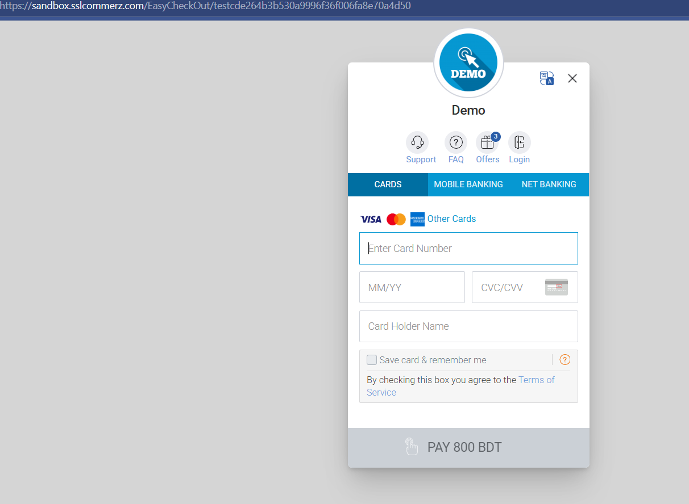
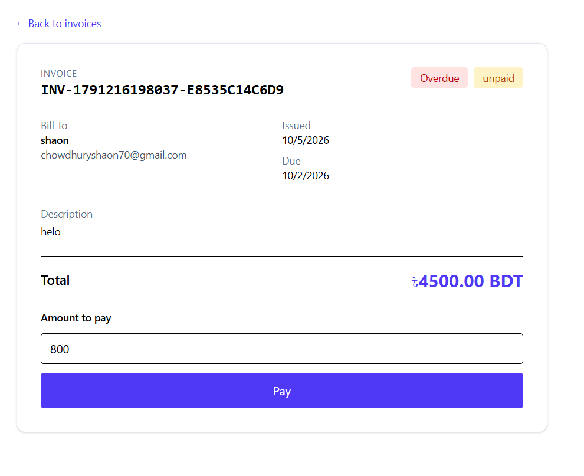

# Payment Tracker

Payment Tracker helps freelancers and small businesses create invoices, track balances, and record payments in one place. It supports full and partial checkout through SSLCommerz, with payment confirmation handled by the API.

## Screenshots

The hosted SSLCommerz checkout opens after a customer starts payment from an invoice. The screenshots below show the sandbox checkout and the invoice payment page.

### SSLCommerz Checkout



### Invoice Payment Page



## Features

- Register and sign in to a private account.
- Create invoices in BDT or USD, with client details, descriptions, and due dates.
- Review paginated invoices, payment status, outstanding balances, and overdue invoices.
- See dashboard totals and collected revenue grouped by currency.
- Start full or partial SSLCommerz payments and view confirmed results.

## How It Works

The React client sends authenticated requests to an Express API. The API stores users and invoices in MongoDB and scopes invoice access to the signed-in user. For checkout, it reserves the requested balance, redirects the customer to SSLCommerz, then validates payment callbacks with the gateway before updating the invoice.

## Tech Stack

React, React Router, Vite, Tailwind CSS, Node.js, Express, MongoDB/Mongoose, JWT, bcrypt, and SSLCommerz.

## Challenges & Solutions

- **Accurate currency calculations:** Invoice amounts are stored as integer minor units instead of floating-point values, avoiding rounding errors.
- **Reliable payment confirmation:** The API validates transactions with SSLCommerz before settlement and handles repeated callbacks idempotently.
- **Concurrent checkouts:** A time-limited payment reservation prevents multiple active checkouts from using the same invoice balance.

## Limitations

- Tokens are stored in browser `localStorage`.
- Checkout requires SSLCommerz credentials and a callback URL reachable by the gateway.
- Automated route tests use MongoDB and gateway test doubles; they do not cover live integrations.
- Password reset, email verification, and a payer-facing invoice portal are not implemented.

## Setup

**Prerequisites:** Node.js 20.19+ or 22.12+, npm, and a reachable MongoDB instance.

Install dependencies from the project root:

```sh
npm ci --prefix server
npm ci --prefix client
```

Copy `server/.env.example` to `server/.env`. Set `MONGO_URI` and a unique `JWT_SECRET` of at least 32 characters. SSLCommerz credentials are optional unless using checkout. For local development, the API defaults to port `5000` and the client uses `http://localhost:5173`.

Run the API and client in separate terminals:

```sh
cd server
npm run dev
```

```sh
cd client
npm run dev
```

Set `VITE_API_URL` when the API is not at its default local URL. For hosted checkout, configure SSLCommerz credentials and set `SSL_BASE_URL` to the public API URL.

## Deployment

The client includes `client/vercel.json` with a rewrite for client-side routes. Build it with `npm run build` from `client`; deploy the API separately with `npm start` from `server` and provide its MongoDB and environment configuration.
